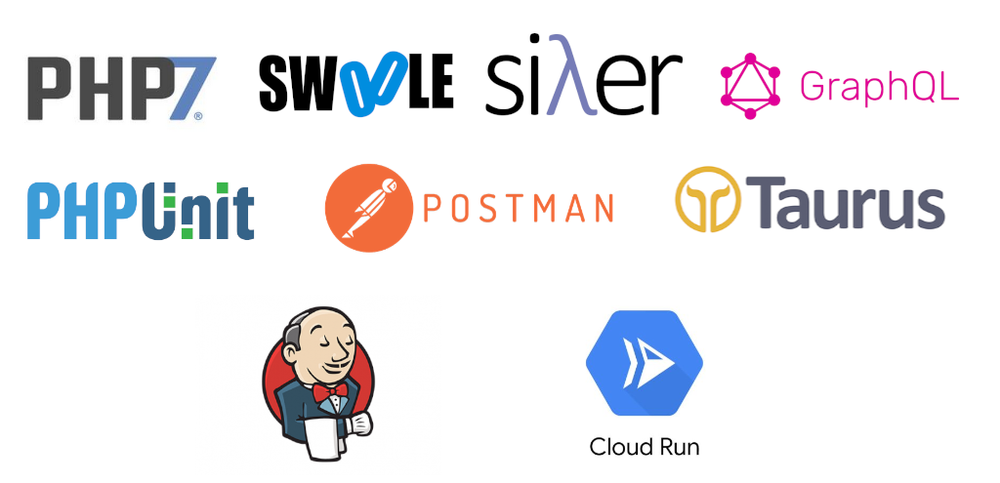
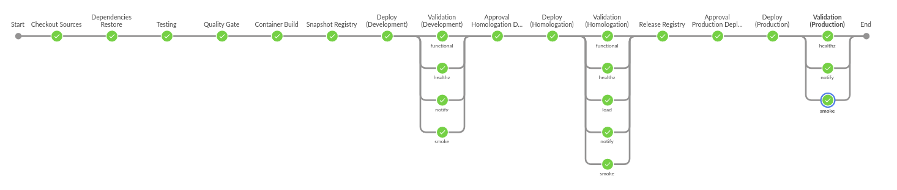
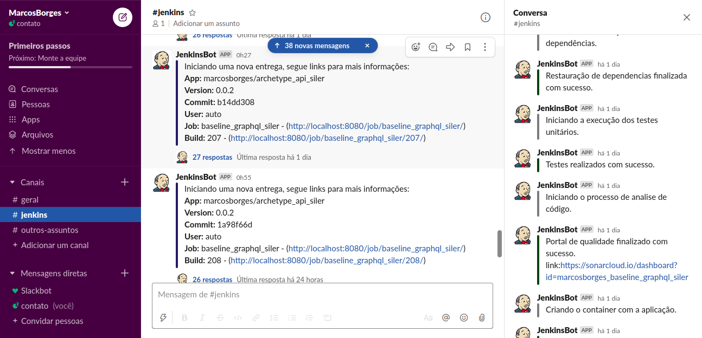
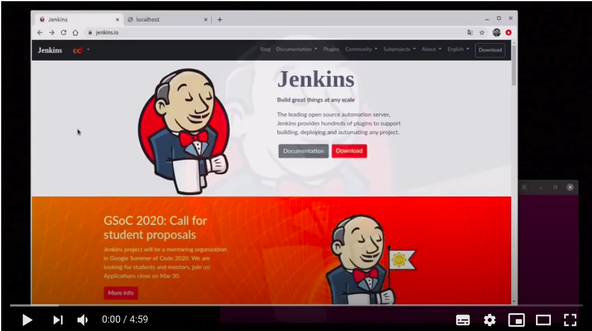
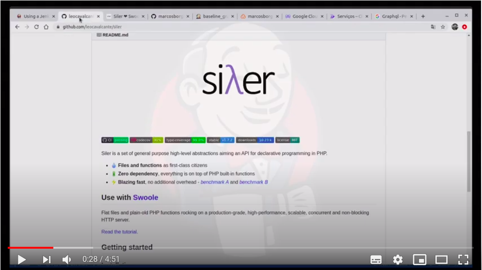

# **Baseline Graphql Siler**

## **Sobre a aplicação**

Aplicação base utilizando **Php7**, **Swoole**, **Siler FW** e **Graphql** para demonstração de esteira **CI/CD** entre diferentes estágios.

---

## **Jekinsfile**

---

### **Resumo**

Pipeline CI/CD entre 3 estágios: desenvolvimento, homologação e produção.

- ***Development***: https://dev-marcosborges-archetype-api-siler-[HASHCLOUDRUN]-ue.a.run.app

- ***Homologation***: https://uat-marcosborges-archetype-api-siler-[HASHCLOUDRUN]-ue.a.run.app

- ***Production***: https://prd-marcosborges-archetype-api-siler-[HASHCLOUDRUN]-ue.a.run.app

*Todo o passo a passo da esteira é notificado no slack e todas as interações que a esteira necessita também são enviadas para o slack contendo um link de acesso a interação.*

---

### **Requisitos**

#### ***Credenciais***

- ***SONAR_KEY*** - Chave de acesso ao sonar https://sonarcloud.io/
- ***GCP_SERVICE_ACCOUNT*** - Conta de Serviço criado no GCP.
- ***REGISTRY_HOST*** - Hostname do registro
- ***SLACK_BOT_KEY*** - Chave de acesso ao slack
- ***APP_ENVFILE_DEV*** - Arquivo de variáveis de ambiente da aplicação para o stage de desenvolvimento.
- ***APP_ENVFILE_UAT*** - Arquivo de variáveis de ambiente da aplicação para o stage de homologação.
- ***APP_ENVFILE_PRD*** - Arquivo de variáveis de ambiente da aplicação para o stage de produção.

---

### **Passos da esteira**

**- Checkout Sources**: Baixa o código fonte, obtem o hash do commit e carrega o log de mudanças

**- Dependencies Restore**: Roda o ***compose update*** para baixar todas as dependências declaradas no compose.json. Todos os arquivos são carregados na pasta vendor na raiz do projeto.

**- Testing**: Roda o ***compose test*** para rodar todos os testes declarados na pasta tests/unit e declarados no phpunit.xml. Serão extraidos e armazenados o resultado dos teste e o arquivo de cobertura.

**- Quality Gate**: O fonte da aplicação junto aos resultados de testes são enviados e analisados pelo ***SonarQube***, no caso da aplicação *não passar na analise o processo de entrega é abortado*.

**- Container Build**: Construção do container utilizando o arquivo ***Build.Dockerfile***, todos os fontes e dependências da aplicação são enviados para o container.  

**- Snapshot Registry**: A imagem do container é enviado para um ***registrador*** de container em um caminho específico para container ainda ***não testado***.

**- Deploy (Development)**: Implanta o container como desenvolvimento na plataforma Google Cloud Platform (GCP), utilizando o serviço ***Cloud Run***. Durante a implantação serão utilizadas as variáveis definidas no arquivo .env armazenado como credencial do tipo arquivo (***APP_ENVFILE_DEV***).

**- Validation (Development)**: Realiza a validação da implantação como desenvolvimento. São analisados o endpoint do ***/health*** aguardando o código de resposta ***200*** e duas coleções do ***Postman*** são executadas utilizando o ***newman***, smoke test e functional test. Eles estão armazenando nas pastas ***tests/smoke*** e ***tests/functional***, coleção e arquivo de variáveis. Antes da execução a url de exposição da aplicação é obtida e utilizada para rescrever a variável hostname dos arquivos de variável do ambiente.

**- Approval Homologation Deploy**: Aguarda a aprovação para continuar a implantação para o estágio de homologação.

**- Deploy (Homologation)**: Implanta o container como homologação na plataforma Google Cloud Platform (GCP), utilizando o serviço ***Cloud Run***. Durante a implantação serão utilizadas as variáveis definidas no arquivo .env armazenado como credencial do tipo arquivo (***APP_ENVFILE_UAT***).

**- Validation (Homologation)**: Realiza a validação da implantação como homologação. São analisados o endpoint do ***/health*** aguardando o código de resposta ***200*** e duas coleções do Postman são executadas utilizando o newman, smoke test e functional test. Eles estão armazenando nas pastas ***tests/smoke*** e ***tests/functional***, coleção e arquivo de variáveis. Antes da execução a url de exposição da aplicação é obtida e utilizada para rescrever a variável hostname dos arquivos de variável do ambiente. Para o estágio de homologação são executados testes de carga utilizando o ***Taurus*** bzt. As configurações dos testes estão na pasta ***tests/load***, A esteira valida se a resposta média do endpoint está abaixo de um determinado tempo, caso não esteja o processo é abortado.

**- Release Registry**: A imagem do container é enviado para um ***registrador*** de container em um caminho específico para container que ***passaram por todos os estágios de teste***.

**- Approval Production Deploy**: Aguarda a aprovação para continuar a implantação para o estágio de produção.

**- Deploy (Production)**: Implanta o container como produçpão na plataforma Google Cloud Platform (GCP), utilizando o serviço ***Cloud Run***. Durante a implantação serão utilizadas as variáveis definidas no arquivo .env armazenado como credencial do tipo arquivo (***APP_ENVFILE_PRD***).

**- Validation (Production)**: Valida a implantação em produção aguardando o endpoint de health e realiza um smoke test. Em caso de falha realiza o rollback para versão anterior.

---

## **COMO UTILIZAR**

### **Instalar o Jenkins**

Instale o Jenkins seguinto as instruções do site https://www.jenkins.io/download/

Serão necessários os seguintes plugin que podem ser instalados na área de gerenciamento do Jenkins:
	
- Allure Jenkins Plugin
- Blue Ocean
- Build Timeout
- Cobertura Plugin
- Command Agent Launcher Plugin
- Config File Provider Plugin
- Docker plugin
- docker-build-step
- HTTP Request Plugin
- HTML Publisher plugin
- Pipeline
- Pipeline Utility Steps
- Slack Notification Plugin
- SonarQube Scanner for Jenkins
- SSH Agent Plugin
- SSH Pipeline Steps
- SSH plugin
- Workspace Cleanup Plugin

***Vídeo de apoio para instalação***

---

### **Configurar as credenciais**

#### Sonarqube

Acesse o ***[sonarcloud](https://sonarcloud.io/)***, realize o cadastro, pode utilizar seu login do github, a analise é gratuita para projetos publicos. Faça a importação do seu projeto e depois vá em configurações e gere um token. Com esse token em mãos crie uma credencial chamada **SONAR_KEY** do tipo texto. Vá ate a área de gerenciamento do Jenkins, clique em configurações na sessão "SonarQube servers", informe o nome **SonarQubeCloud**, a url: **https://sonarcloud.io/** e selecione a credencial: **SONAR_KEY**

#### Slack

Acesse o [slack](https://api.slack.com/apps) faça seu cadastro, criei um novo aplicativo, habilite o bot e configure o escopo de permição para ler e gravar mensagens nos canais. Crie uma credencial chamada SLACK_BOT_KEY do tipo texto e armazene o token gerado no painel do slack. Na área de gerenciamento do jenkins vá até a sessão Slack, forneça a url da sua workspace (ex: marcosborgesworkspace.slack.com) selecione a credencial SLACK_BOT_KEYe informe o id do canal (ex: C012UE84TN1).

Caso não deseje utilizar o slack você pode comentar todas as linhas do Jenkinsfile que contem o comando: *slackSend(...*

#### Variáveis de ambiente

Crie 3 credenciais do tipo text para armazenar os arquivos de variaveis de ambiente (.env), um para cada ambiente: APP_ENVFILE_DEV, APP_ENVFILE_UAT e APP_ENVFILE_PRD

#### Conta de serviço do GCP (Google Cloud Platform)

Acesse o painel do [GCP](https://console.cloud.google.com) realize o cadastro, cadastre o meio de pagamento e vá até a área IAM -> contas de serviço, crie uma nova chave de serviço e salve o arquivo.json como uma credencial do tipo arquivo chamado GCP_SERVICE_ACCOUNT em seu Jenkins.

---

### **Criar a pipeline**

Acesse o jenkins crie um job do tipo pipeline, vá até a sessão pipeline troque para "script from SCM", no campo SCM selecione git e informe o endereço do repositório: https://github.com/marcosborges/baseline_graphql_siler.git

***Vídeo de apoio para criação de pipeline***

